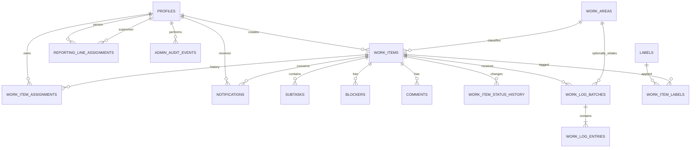

# Conceptual data model

**Version:** 0.6  
**Checkpoint date:** 2026-07-16  
**Status:** Approved concepts with D-118 derived reporting amendments

This document translates the approved product rules into implementation-facing entities and invariants. Exact SQL types, indexes, triggers, functions, and row-level-security policies must be reviewed when the first Supabase migration is written.

## 1. Model principles

- One team only; do not add organizations, workspaces, `team_id`, or membership tables.
- Use Supabase Auth for identity and a public profile for organizational position, independent Admin privilege, and active state.
- Treat current ticket values as snapshots and preserve meaningful changes as history.
- Keep planned dates, actual work dates, and system timestamps distinct.
- Derive contributors and metrics from non-withdrawn work entries rather than maintaining manual credit.
- Use soft withdrawal/archive behavior; normal product actions never hard-delete history.
- Enforce access with Row Level Security even when a UI hides an action.
- The browser may use `supabase-js` directly for ordinary RLS-safe reads and writes. Auth-admin operations and any service-role action must run server-side or in a protected Edge Function.

## 2. Entity map

## 3. Identity and controlled lists

### `profiles`

One row per Supabase Auth user.

Suggested fields:

- `id` — matches `auth.users.id`
- `email`
- `display_name`
- `position` — `viewer | designer | lead | manager`
- `is_admin` — independent portal-administration privilege
- `is_active`
- `must_change_password`
- `current_reports_to_id` — nullable current supervisor snapshot
- `created_at`
- `updated_at`

Only Admin-privileged users manage positions, Admin privilege, reporting lines, and active state. Every position, Admin-privilege, and active-state change records actor, time, previous value, and new value. The system must not allow the organization to end with no active Admin-privileged account. Deactivation must prevent normal data access while preserving attribution on historical records.

`is_admin = true` is valid only when `position` is Designer, Lead, or Manager. Account creation and access-management operations reject Viewer + Admin. A position change to Viewer must set `is_admin = false` in the same atomic operation.

The shared Team directory reads only active profiles and exposes display name, position, Admin badge, and reporting relationship. Work email and authentication metadata remain Admin-only. Last sign-in may be read server-side from Supabase Auth for account support and is not copied into work reporting.

### `reporting_line_assignments`

Preserve the effective-dated reporting relationship from Designer to Lead and from Lead to Manager.

- `id`
- `person_id`
- `supervisor_id`
- `started_on`
- `ended_on` — nullable for the current relationship
- `assigned_by`
- `created_at`

Rules:

- A Designer has at most one current Lead; a Lead has at most one current Manager.
- A Manager has no required parent in the MVP.
- Only Admin-privileged users create, change, or close reporting relationships.
- A Lead group includes the Lead and direct-report Designers.
- A Manager group includes the Manager, direct-report Leads, and the Designers beneath those Leads.
- Reject self-reporting, cycles, Designer-to-Designer, Lead-to-Lead, and invalid position pairings.
- A position change and any required reporting-line closure/reassignment must be validated and committed together while preserving the previous intervals.
- Do not enforce exactly one Manager; the current organization has one, but multiple Manager branches remain valid.
- `profiles.current_reports_to_id` must agree with the open assignment interval when used as a current-query cache.
- Dashboard and current-list scopes use the current relationship. Period reports resolve the relationship that applied to each relevant work or ticket event date.
- Reporting groups never narrow Row Level Security for Leads, Managers, or Admin-privileged users.
- Default scope derives from `position`, not `is_admin`: Designer = Me, Lead = Lead group, Manager = Manager group, Viewer = All.

### `work_areas`

Area/Squad vocabulary managed only by Admin-privileged users.

- `id`
- `name`
- `sort_order`
- `is_active`
- `created_by`
- `created_at`
- `archived_by`
- `archived_at`

Names should be unique among active rows. Archived values remain joinable from historical work.

### `labels`

Optional ticket-label vocabulary managed only by Admin-privileged users.

- `id`
- `name`
- `sort_order`
- `is_active`
- `created_by`
- `created_at`
- `archived_by`
- `archived_at`

### `work_item_labels`

Many-to-many assignment of existing labels to tickets.

- `work_item_id`
- `label_id`
- `applied_by`
- `applied_at`

Use a unique constraint on `(work_item_id, label_id)`.

### `team_settings`

One singleton row for the single-team product.

- `id` — fixed singleton key
- `timezone` — required IANA timezone identifier
- `updated_by`
- `updated_at`

Only Admin-privileged users may update it. Store timestamps in UTC and use the timezone for display and team-local day boundaries. Explicit `work_date` values never shift when timezone changes.

### `admin_audit_events`

Append-only Settings/access audit history.

- `id`
- `event_type`
- `actor_id`
- `subject_type`
- `subject_id`
- `previous_values` — structured and nullable
- `new_values` — structured and nullable
- `occurred_at`

Cover account creation, position/Admin/access-state changes, reporting lines, password-reset actions without credential content, Areas/Squads, labels, and timezone changes. Only Admin-privileged users may read the administration audit. No product action may update or delete these rows.

### `notifications`

Recipient-specific in-app event records.

- `id`
- `recipient_id`
- `actor_id`
- `work_item_id`
- `source_event_id` — stable reference used for idempotency
- `notification_type` — stable approved event code
- `created_at`
- `read_at` — nullable

Approved notification-type codes:

- `assigned_to_you`
- `reassigned_away_from_you`
- `status_changed`
- `blocker_created`
- `blocker_resolved`
- `comment_added`

Rules:

- Add a unique constraint covering recipient, notification type, and source event so retries cannot duplicate records.
- Do not store comment bodies, blocker reasons, passwords, or other unnecessary free text in notification rows.
- Only the recipient reads records or changes `read_at`.
- Notification creation never broadens Work Item access.
- Admin privilege does not change recipient selection.
- No notification-preferences, delivery-channel, digest, or scheduled-reminder tables exist in the MVP.

## 4. Work-item core

### `work_items`

Suggested fields:

- `id`
- `display_id` — human-readable generated ticket ID
- `title`
- `description` — nullable
- `area_id` — required
- `status` — fixed MVP enum
- `primary_assignee_id` — current snapshot; nullable only where allowed
- `planned_start_date` — nullable date
- `due_date` — nullable date
- `figma_url` — nullable single URL
- `created_by`
- `created_at`
- `updated_at`
- `last_worked_on` — derived/cacheable nullable date
- `last_activity_at`
- `completed_at` — most recent Done timestamp, nullable
- `archived_by` — nullable
- `archived_at` — nullable

Fixed status values:

- `backlog`
- `todo`
- `in_progress`
- `in_review`
- `done`
- `paused`

Invariants:

- Title and Area/Squad are required.
- Active statuses (`todo`, `in_progress`, `in_review`) require a primary assignee.
- A primary assignee must have Designer, Lead, or Manager position; Viewer is not assignable and cannot hold Admin privilege.
- Only `backlog`, `paused`, and `done` may be archived.
- Figma URL is the only external-link field.
- There is no project or priority column.
- Changing core fields updates `updated_at` and creates an audit event.
- Work logging updates `last_activity_at` and may recalculate `last_worked_on`; it does not rewrite `updated_at`.

### `work_item_assignments`

Preserve primary-assignee periods rather than only the current snapshot.

- `id`
- `work_item_id`
- `assignee_id`
- `started_at`
- `ended_at` — nullable for the current assignment
- `assigned_by`

Allow only one current assignment per ticket. The current open interval must agree with `work_items.primary_assignee_id`.

Assignment history is required to classify backdated work and to credit the primary assignee at completion.

### `work_item_status_history`

- `id`
- `work_item_id`
- `from_status` — nullable for creation
- `to_status`
- `changed_by`
- `changed_at`

Moving from Done to any other status is a reopen event. Do not overwrite the preceding Done transition.

### `work_item_events`

Append-only audit events for meaningful non-status changes.

- `id`
- `work_item_id`
- `event_type`
- `actor_id`
- `occurred_at`
- structured previous/new values where relevant

Examples include Area/Squad changes, assignee changes, date changes, Figma URL changes, label changes, subtask changes, comment withdrawal, work-log correction, and archive/restore.

## 5. Subtasks, comments, and blockers

### `subtasks`

- `id`
- `work_item_id`
- `title`
- `position`
- `is_completed`
- `created_by`
- `created_at`
- `completed_by` — nullable
- `completed_at` — nullable
- optional withdrawal metadata for removed checklist items

Subtasks never contain parent IDs, assignees, statuses, work logs, dates, comments, labels, or Figma URLs.

The `completed/total` badge is derived from non-withdrawn rows.

### `comments`

- `id`
- `work_item_id`
- `author_id`
- `body`
- `created_at`
- `edited_at` — nullable
- `withdrawn_at` — nullable
- `withdrawn_by` — nullable

Retain comment revisions in audit data. Comments affect `last_activity_at`, not `last_worked_on` or reporting credit.

### `blockers`

- `id`
- `work_item_id`
- `reason`
- `blocked_by`
- `blocked_at`
- `expected_resolution_date` — nullable
- `resolved_by` — nullable
- `resolved_at` — nullable
- `resolution_note` — nullable

Invariants:

- One unresolved blocker per ticket at most.
- A blocker requires a reason.
- An active blocker is allowed only while the ticket is To do, In Progress, or In Review.
- Moving to Backlog, Paused, or Done requires the active blocker to be closed.
- Resolution closes the current record; it never deletes it.

## 6. Work logging

### `work_log_batches`

One user submission, containing one to five dated entries.

- `id`
- `context` — `ticket | standalone_visual`
- `work_item_id` — required for ticket context, null for visual context
- `related_area_id` — optional for visual context
- `worked_by`
- `logged_by`
- `created_at`
- `edited_at` — nullable
- `withdrawn_at` — nullable
- `withdrawn_by` — nullable

Context checks:

- Ticket batches require `work_item_id` and do not use `related_area_id` as a substitute for the ticket's own area.
- Standalone visual batches require no ticket and may optionally reference an Area/Squad.
- A batch contains between one and five active entries.

### `work_log_entries`

One actual work date within a batch.

- `id`
- `batch_id`
- `work_date`
- `work_type_code`
- `description` — nullable, including for Other
- `position`

Rules:

- Future `work_date` values are invalid.
- Friday and Saturday are excluded by UI default but remain valid when manually selected.
- Work type codes must match the batch context's fixed vocabulary.
- A duplicate same-person, same-ticket, same-date entry may warn in UI but is not prohibited because distinct work types can occur.
- Reports use `work_date`; audit uses batch `created_at`/`edited_at`.

Ticket work-type codes:

- `planning_alignment`
- `discovery_research`
- `mapping_information_architecture`
- `ideation_wireframing`
- `ui_visual_design`
- `prototyping_interaction`
- `design_system`
- `testing_validation`
- `review_iteration`
- `documentation_handoff`
- `design_qa_implementation_support`
- `team_support_collaboration`
- `other`

Visual work-type codes:

- `new_visual_asset`
- `resizing_adaptation`
- `presentation_support`
- `image_editing`
- `illustration_iconography`
- `other_visual_work`

### Editing and withdrawal

- Keep revision data sufficient to reconstruct previous date, type, description, context, and attribution values.
- A Designer may edit a batch where they are `worked_by`.
- Leads, Managers, and Admin-privileged users may edit any batch.
- Changing `worked_by` to someone else is limited to Leads, Managers, and Admin-privileged users.
- Withdrawal excludes the batch and its entries from normal queries and aggregates without hard deletion.
- Recalculate ticket contributor display, `last_worked_on`, and metrics after an applicable correction or withdrawal.

## 7. Contributor derivation

Contributor credit is date-sensitive:

1. Take each active ticket work entry.
2. Determine the ticket's primary assignee for the entry's `work_date` from assignment history.
3. If `worked_by` differs, classify the designer as a contributor for that date and ticket.
4. If it matches, classify the entry as primary-assignee activity.

The current contributor list is the distinct set of designers with valid contribution activity. It must not be a manually editable source of truth.

If a withdrawn/corrected entry was the designer's only contribution, remove them from the current contributor display while retaining the audit record.

## 8. Derived timestamps and recalculation

- `last_worked_on` = maximum non-withdrawn ticket `work_date`.
- `last_activity_at` = maximum system occurrence time across core changes, work-log submissions/edits, comments, blockers, and relevant subtask activity.
- `updated_at` changes only for core ticket-field changes.
- `completed_at` changes when a ticket enters Done; earlier completion transitions stay in status history.
- Backfilled work can change `last_worked_on` only if its actual date is later than the previous maximum; it always creates current audit activity.

Prefer database functions/triggers or transaction-safe repository operations for these recalculations. Document and test whichever mechanism is selected.

### Dashboard/reporting derivations

- `planned_until` = maximum Next Deadline (`due_date` internally) among a person's current unarchived primary-owned tickets in `todo` or `in_progress`.
- Contributor activity is excluded from `planned_until`.
- Queries must also return the number of qualifying active owned tickets without next deadlines so the UI never presents a partial horizon as complete.
- `no_recent_work_recorded` uses the most recent valid ticket or standalone-visual `work_date`, not authentication login time.
- Ticket `active_work_days` is the retained internal response key for Days Active: count distinct valid Sunday–Thursday ticket `work_date` values across all designers; multiple people or entries on the same date count once, while Friday/Saturday logs remain visible.
- Ticket Reports and CSV default to `not_archived`; an explicit archived-state filter controls the same scoped rows used by cards/counts, charts, tables, pagination, drill-downs, and exports.
- No availability-period or capacity-inference entity exists in the MVP.

## 9. Row-level-security intent

Exact policies remain an implementation task, but the first migration must enforce these boundaries:

- Inactive profiles receive no normal application data access.
- Viewer: whole-team read-only access to normal Dashboard, ticket, comment, work-history, report, archived-history, and Figma-link data; no export or Settings access. Viewer + Admin is an invalid account state.
- Designer: create tickets; edit tickets they created, currently own, or have contributed to; log ticket work; manage own attributed logs; add/edit own comments.
- Lead: Designer access plus view and edit across the full team, log on behalf, correct any log, moderate comments, archive/restore eligible tickets, and export Reports. Their Lead group is only a default/filter scope.
- Manager: Lead operational access with a Manager-group default containing the Manager, reporting Leads, and Designers beneath those Leads.
- Admin privilege: for Designer, Lead, or Manager, grants every operational capability plus accounts, positions, Admin privilege, reporting lines, Areas/Squads, labels, and system settings. It never replaces the position or reporting line.
- Service-role credentials are never shipped to the browser.

Viewer is not Area/Squad-restricted in the MVP. Future PO/external access requires a separate access model and policy design rather than silently narrowing Viewer.

## 10. Schema items deliberately absent

- `teams`, `organizations`, or `team_memberships`
- `projects` or `epics`
- `work_item_assignees` many-to-many ownership
- priority fields
- attachment/storage tables
- generic-link tables
- manually editable contributor tables
- nested-subtask relations
- hours, effort points, or capacity scores
- availability periods, capacity calendars, or inferred free-date tables

## 11. Change-safe fixed rules

`Fixed in the MVP` means not editable through Settings. It must not mean that future releases require destructive rewrites.

- Persist stable internal codes separately from displayed labels for statuses, ticket work types, visual work types, organizational positions, and other controlled values.
- Do not repurpose an existing code to mean something different. A label may change while its historical code remains stable.
- Implement statuses and work-type vocabularies through system-managed reference data or an equivalently migration-safe constraint design. They are not Admin-managed lists in the MVP.
- Support retiring a historically used value from new selection while preserving it on existing records, timelines, reports, and exports.
- Centralize working-day rules, stale/due-soon thresholds, workflow transition rules, and status-to-reporting-bucket mappings instead of duplicating them in UI, database, and report code.
- Centralize position capabilities and the Admin overlay; enforce the same definitions in UI authorization, server/database policies, and automated tests.
- Use versioned database migrations for additions, retirements, label changes, workflow changes, and permission changes.
- Every such migration requires compatibility notes and tests covering existing historical records, current queries, reports, exports, and Row Level Security.
- Derived caches and materialized values must be recalculable when an approved rule changes.

The technical plan must choose the exact SQL/configuration mechanism that satisfies these invariants before the first migration is approved.
